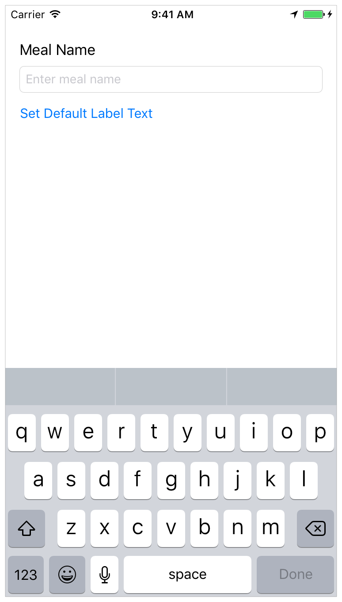

# Day 1

## Day 1 Morning

### Getting Start with Xcode

- Get `Xcode`, install and use.
- Create new `Project`
- Get Familiar with `Xcode`
- Run iOS Simulator
- Review the Soruce Code
	- AppDelegate Source File
	- The View Controller Source File
	- Open Storyboard

### Create a ViewController

- Basic UI with Auto Layout
	- Label
	- TextField
		- TextField's Keyboard
	- Button
	- Rearrange UI
	- To view outline view
- Preview interface
	- Orientation
	- To preview difference screen size
- Adopt Auto Layout
	- Using `UIStackView`
	- Create constraints
	- Adjust `UIStackView`'s subViews
- Debugging Auto Layout

### Connect UI to Code

- Link view controller in storyboard to ViewController
	- Create outlets for UI elements
	- Create Action
	- Implement some code to interact with UI
- Process user input
	- Adopt UITextFieldDelegate protocol
	- Set `ViewController` object as the `delegate` of `textField` property
	- Implement the `UITextFieldDelegate` protocol method `textFieldShouldReturn(_:)`
	- Implement the `UITextFieldDelegate` protocol method `textFieldDidEndEditing(_:)`

### Work with View Controllers

- Understand View Controller Lifecycle
	- `viewDidLoad()`, `viewWillAppear()`, `viewDidAppear()` `viewWillDisappear()`, `viewDidDisappear()`

### Work with Git (Version Control)

- Introduction to version control
- Register to a git service. eg. `GitHub`, `BitBucket`
- Getting to know some basic command
	- git init
	- git remote add
	- git commit
	- git push

### Add a photo

- Add image to `scene`
	- Use size inspector
	- Create `asepct ratio` constrant
- Display a Default Photo
	- Add image to project
	- Set defaukt image to image view
- Connect image to code

### Add photo from photo library

- Create a Gesture Recognizer
- Connect the Gesture Recognizer to Code
- Create an Image Picker to Respond to User Taps
- Adopt the `UIImagePickerControllerDelegate` and `UINavigationControllerDelegate` protocol
	- Implement the `selectImageFromPhotoLibrary(_:)` action method
	- Implement the `imagePickerControllerDidCancel(_:)` method
	- Implement the `imagePickerController(_:didFinishPickingMediaWithInfo:)` method
- Add a photo library `usage description`
- Add image to iOS Simulators

## Day 1 Afternoon

### Implementations a Custom Control

- Create a Custom View
	- Create a subclass of `UIStackView`
	- Override the initializers

### Display the Custom View

- Display the view
- Add Buttons to the View
	- Create a button in your view
	- Add action to button
	- Add rating properties
	- Create a total of five buttons
- Declare the control as @IBDesignable
- Add inspectable properties
- Add images to project
- Set star images for buttons

### Implement Button Action

- Implement rating aciton
- Add `accessibility labels`, `values`, and `hints`

### Connecting rating control to View Controller

- Connect a rating control outlet to `ViewController.swift`

### Clean Up the Project

- Clean up the UI
- Clean up the code

### Deinge Data Model

- Create a new data model class
- Define a data model
- Test data using `XCTest`

***Remark***: *Most of first 2 days lessons are from [Start Developing iOS Apps (Swift)](https://developer.apple.com/library/content/referencelibrary/GettingStarted/DevelopiOSAppsSwift)*