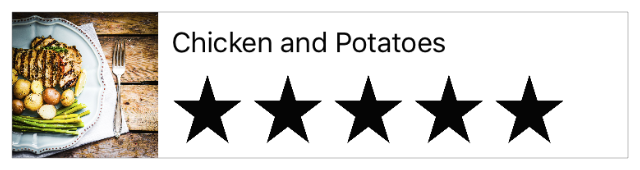

# Day 2

## Day 2 Morning

## Higher Order Function (Intermediate)

- Put `function` into `function`, `execute` it then `return` value
- Create `function` that return `function`, and use it
- Introdunction to `enum`

***Remark:*** *Use Swift Playground*

## Create Table View

### Working with Table Views

- Create List
  - Add a scene with a table view to your storyboard
  - Set list as the initial scene
  - Configure the table view

### Design Custom Table Cells

- Create a subclass of UITableViewCell
- Configure a custom cell for table view
- Design the interface of the custom table cell
- Preview your interface

### Connect the Table Cell UI to Code

- Connect the views to the `TableViewCell.swift` code
- Configure and display cells in your table view
- Point the Table View Controller to `TableViewController.swift`

### Prepare the Meal Detail Scene for Navigation

- Clean up unused pieces of the project
- Rename the `ViewController.swift` file

## Implement Navigation

### Add a Segue to Navigate Forward

- Add a navigation controller to your list scene
- Add a navigation controller to the detail scene

## Day 2 Afternoon

## Implement Edit and Delete Behavior

### Enable Editing of Existing

- Configure the table view cell
- Identify which segue is occurring
- Update the implementation of `viewDidLoad`
- Update the implementation of `unwindToList(sender:)` to both add and edit

### Cancel an Edit to an Existing

- Change the implementation of the cancel action

### Support Deleting

- Add an Edit button to the table view
- Delete

## Persis Data

### Save and Load

- Implement a coding key structure
- Subclass `NSObject` and conform to `NSCoding`
- Implement the `encodeWithCoder` `NSCoding` method
- Implement the initializer to load
- Create a file path to data
- Implement the method to load the list
- Save the meal list when a user adds, removes, or edits
- Load the meal list at the appropriate time
